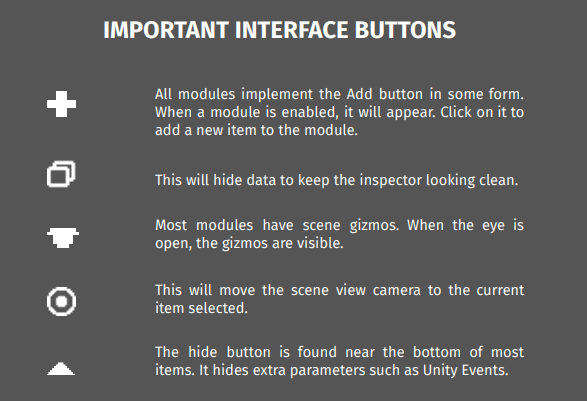

Introduction
++++++++++++

If reading the auto generated pdf version, go to https://twobitmachines.github.io/SafireEngineDocs
for a more readable experience. If you have any questions or feedback, 
please contact us at TwoBitMachinesDev@gmail.com.

Welcome! This is the documentation for Safire Engine. This tool
contains modules that are fundamental to any 2D camera system. It
has a friendly interface that makes it fast and easy to setup these systems.
Simply put the **SafireCamera** component on the camera gameobject to 
get started.

Next, choose the target to follow. This is typically the player, and you will 
need to set the Transform reference. If you choose User, the system is expecting 
the camera to be controlled with the pan, zoom, and rotate modules. If the camera 
is a perspective camera, choose the zooming mode. Either zoom by FOV or by distance.

Once setup, you will need to add modules. Click the "Module+" button to open 
the module menu. Select what you need, then press the left button to enable the module. 
If you want to remove a module, click the close or minus button on the module bar.
The Follow and Pixel Perfect module will always be visible by default.

.. important:: 
   The camera will execute in Late Update only.

   
|

Important Methods
=================

.. list-table::
   :widths: 25 100
   :header-rows: 1

   * - Method
     - 

   * - ResetAll()
     - Call this when there is a game reset or when the player changes position abruptly, like a teleportation.
       If using Flare Engine, this will be called automatically on a game reset.

   * - ModuleEnable(string moduleName)
     - Enable the specified Module.

   * - ModuleDisable(string moduleName)
     - Disable the specified Module.

   * - PauseFollowMechanics (bool enable)
     - This pauses all the modules that modify the camera's position in a meaningful way but leaves modules
       like shake, parallax, etc, still active if enabled. 
       This can be useful in case another system needs to take control of the camera.